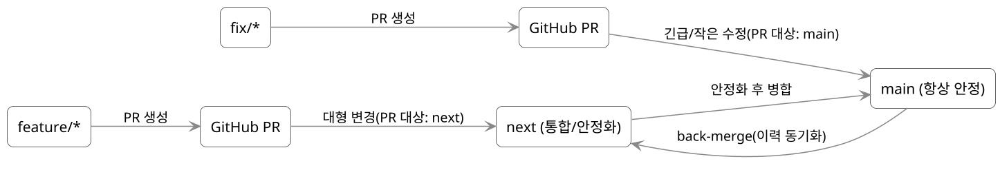

# 브랜치 관리 — LynJS의 협업 플로우

## 왜 브랜치 전략이 필요한가?

혼자 하는 작은 프로젝트라면 `main` 하나로도 충분하다.
하지만 프레임워크처럼 **여러 명이 기여**하고 **장기 유지**해야 하는 프로젝트라면 얘기가 달라진다.

- **안정성:** `main`은 언제든지 사용 가능한 상태여야 한다.
- **속도:** 새 기능은 브랜치 따서 빠르게 시도한다.
- **조율:** 대형 변경은 안전하게 모아 검증할 공간이 필요하다.

즉, 브랜치 전략은 **안정성과 실험 속도의 균형**을 잡는 장치다.

## 업계에서 쓰는 전략들 요약

**Git Flow**

- `main`, `develop`, `feature/*`, `release/*`, `hotfix/*`
- **장점:** 역할 분담 뚜렷 / **단점:** 운영 복잡도↑

**GitHub Flow**

- `main` + 짧게 쓰는 브랜치(`feature/*`, `fix/*`)
- **장점:** 단순, CI/CD 친화 / **단점:** 대형 변경 안정화 공간 부족

**Trunk-Based Development**

- 사실상 `main` 하나 + feature flag
- **장점:** 지속 통합·자주 배포 / **단점:** 플래그 관리 부담

LynJS의 선택 — GitHub Flow + `next`
LynJS는 **GitHub Flow**의 간결함을 유지하되, **대형 변경을 위한 완충 브랜치 `next`**를 둔다.

- **main:** 항상 안정. 사용자에게 기본으로 노출되는 브랜치
- **next:** 다음 **마이너/메이저** 준비용 통합 브랜치(브레이킹·다패키지 교차 작업을 모아 안정화)
- **feature/_, fix/_**:\*\* 짧게 가져가는 토픽 브랜치(작은 건 `main`, 큰 건 `next`로 PR)
- **release/\*** (선택): 메이저 직전 동결 기간 필요 시 잠깐 사용

### 브랜치 흐름(PlantUML)



- 작은 변경 → `feature/* → main`
- 대형 변경 → `feature/* → next`에서 모아 안정화 후 `next → main`
- 긴급 수정 → `fix/* → main` → 이후 `main → next` 역병합으로 동기화

## 머지 & 리뷰 원칙

- **작은 PR** 지향(리뷰 부담↓)
- **Conventional Commits** 포맷 권장(CHANGELOG·자동화 대비)
- PR은 **리뷰 1명 이상 승인** 후 머지
- **Squash merge** 기본(히스토리 간결)
- `main`, `next`에는 **브랜치 보호 규칙**을 적용(Force-push 금지, 리뷰 필수 등)

> Conventional Commits 기본형
>
> ```
> <type>(<scope>): <subject>
> ```
>
> 예) `feat(core): add @connected.move`, `fix(dom): prevent double attributeChangedCallback`
