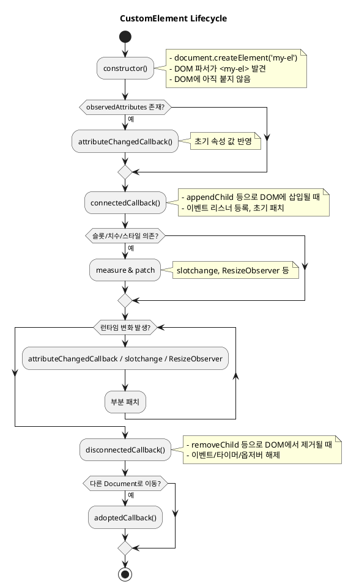

# CustomElement 생명주기 이해

웹 컴포넌트를 만들다 보면 단순히 `class MyElement extends HTMLElement`만 선언하는 것으로는 충분하지 않다. 실제 화면에
붙는 시점, 속성이 변하는 시점, DOM에서 제거되는 시점은 브라우저가 자동으로 관리해준다. 이 흐름을
**생명주기(lifecycle)**라고 부른다.

## 왜 CustomElement의 생명주기를 이해해야 하는가?

- **초기화 타이밍**: DOM에 추가될 때 어떤 준비를 해야 하는지 알 수 있다. (예: 이벤트 리스너 등록, 초기 렌더링)
- **정리 타이밍**: DOM에서 제거될 때 리소스를 어떻게 해제해야 하는지 알 수 있다. (예: 타이머 해제, Observer 해제)
- **데이터 동기화**: 속성이 변했을 때 화면을 갱신하거나 내부 상태를 맞추는 기준이 된다.

> 생명주기를 이해하지 못하면, **메모리 누수**나 **의도하지 않은 UI 동작** 같은 문제가 생긴다.

## LynJS 같은 프레임워크 설계에서 어떤 역할을 하게 될지

LynJS는 단순한 유틸리티 모음이 아니라 **CustomElement 기반의 프레임워크**다. 따라서 생명주기는 곧 프레임워크의 뼈대와
직결된다.

- `connectedCallback`: LynJS의 `render()`를 호출하는 트리거
- `disconnectedCallback`: 상태와 이벤트를 정리하는 지점
- `attributeChangedCallback`: dom 속성이 병경될때 인스턴스 속성과 연결해 자동 갱신하는 지점
- `adoptedCallback`: 문서 간 이동을 지원하는 고급 기능에서 활용 가능

즉, 생명주기를 이해한다는 건 단순한 API 학습이 아니라, **LynJS의 핵심 클래스(LynElement)가 언제 무엇을 해야 하는지
설계할 수 있는 기준을 세우는 것**이다.

좋습니다. 이번 섹션은 독자가 “생명주기 설명 전에 기본 틀부터 잡아야겠구나” 하고 이해할 수 있게 간단하면서도 실용적인
예제를 넣으면 좋아요.

## CustomElement의 기본 구조

CustomElement는 브라우저에서 기본 제공하는 `HTMLElement`를 상속받아 만든다. 그 위에 자신만의 동작을 추가하고,
`customElements.define()`을 통해 태그 이름과 연결하면 끝이다.

### class MyElement extends HTMLElement

```ts
class MyElement extends HTMLElement {
  constructor() {
    super();
    console.log('MyElement created');
  }
}
```

여기서 중요한 점은 `constructor` 안에서는 DOM에 아직 붙지 않았다는 것이다. 즉, 엘리먼트가 생성만 되었을 뿐, 화면에
보이지는 않는다. 실제로 화면에 붙을 때는 이후에 다룰 `connectedCallback`에서 처리하게 된다.

### customElements.define()

```ts
customElements.define('my-element', MyElement);
```

이 과정을 거쳐야 `<my-element></my-element>`라는 태그가 HTML 안에서 인식된다. 정의하지 않으면 브라우저는 단순한 “이름만
긴 태그”로 취급한다.

## DOM에 붙이고 떼는 과정

CustomElement는 보통 이렇게 흐른다:

1. 생성 (constructor)
   - 자바스크립트에서 `document.createElement('my-element')` 또는 DOM 파서가 `<my-element>`를 만났을 때 호출된다.
   - 이 시점에는 DOM에 추가되지 않은 상태.
2. Dom 속성 변경(attributeChangeCallback)
3. 연결 (connectedCallback)
   - `document.body.appendChild(el)`처럼 실제 DOM에 삽입되면 호출된다.
   - 여기서 이벤트 리스너 등록 등을 진행한다.
4. 해제 (disconnectedCallback)
   - `parent.removeChild(el)` 같은 방식으로 DOM에서 제거될 때 호출된다.
   - 이때 이벤트 리스너 해제, 타이머 정리 같은 cleanup을 한다.

## CustomElement Lifecycle



## 생명주기 콜백(Lifecycle Callbacks)

CustomElement는 표준으로 정의된 몇 가지 **라이프사이클 콜백**을 통해 DOM과 상호작용한다. 이 콜백들은 브라우저가 특정
시점에 자동으로 호출해주며, 우리가 원하는 초기화·정리·업데이트 로직을 넣는 자리가 된다.

### connectedCallback

- 요소가 실제 DOM 트리에 **처음 삽입될 때** 호출된다.
- 주로 **이벤트 리스너 등록, 초기 데이터 패치, 외부 DOM 참조** 등이 이 시점에 이뤄진다.

```ts
class CustomElement extends HTMLElement {
  connectedCallback() {
    console.log('요소가 DOM에 연결됨');
    this.addEventListener('click', this.onClick);
  }
}
```

### disconnectedCallback

- 요소가 **DOM에서 제거될 때** 호출된다.
- 여기서는 **이벤트 해제, 타이머 정리, 옵저버 해제** 같은 cleanup을 수행한다.

```ts
class CustomElement extends HTMLElement {
  disconnectedCallback() {
    console.log('요소가 DOM에서 제거됨');
    this.removeEventListener('click', this.onClick);
  }
}
```

### attributeChangedCallback

- 지정된 속성이 **추가/변경/삭제될 때** 호출된다.
- 이 콜백이 동작하려면, 먼저 `static get observedAttributes()`로 어떤 속성을 관찰할지 등록해야 한다.

```ts
class CustomElement extends HTMLElement {
  static get observedAttributes() {
    return ['value', 'disabled']; // 관찰 대상 속성
  }

  attributeChangedCallback(name: string, oldVal: string | null, newVal: string | null) {
    console.log(`${name} 속성이 ${oldVal} → ${newVal}로 변경됨`);
    this.render();
  }
}
```

### `adoptedCallback`

- 요소가 **다른 Document로 옮겨질 때** 호출된다. (예: `<iframe>` 간 이동)
- 흔히 쓰이진 않지만, 멀티-Document 환경에서 유용하다.

```ts
class CustomElement extends HTMLElement {
  adoptedCallback(oldDoc: Document, newDoc: Document) {
    console.log('요소가 다른 Document로 이동됨');
  }
}
```

### `static get observedAttributes()`

- 어떤 속성을 **attributeChangedCallback에서 관찰할지** 브라우저에 알려주는 정적 메서드.
- 문자열 배열을 반환해야 하며, 여기에 없는 속성은 변경돼도 콜백이 호출되지 않는다.

### 요약

- **연결**: `connectedCallback`
- **해제**: `disconnectedCallback`
- **속성 반영**: `attributeChangedCallback` + `observedAttributes`
- **Document 이동**: `adoptedCallback`

이 네 가지 콜백이 CustomElement 생명주기의 기본 틀을 이룬다.

## 각 콜백 예제

### 이벤트 리스너 바인딩/해제 — `connected / disconnected`

아래 코드는 **이벤트 리스너의 등록과 해제**에 관한 예제이다. CustomElement는 DOM에 추가되거나 제거될 때 브라우저가
자동으로 콜백을 호출해주므로, 이 시점을 활용해 **이벤트 리스너를 안전하게 관리**할 수 있다.

예제에서는 `shadowRoot` 내부에 클릭 이벤트를 바인딩하고 해제하는 방식을 보여주고 있다. `connectedCallback`이 호출되면
버튼에 클릭 리스너를 붙이고, `disconnectedCallback`이 호출되면 해당 리스너를 제거한다.

```ts
class XCounter extends HTMLElement {
  private root = this.attachShadow({ mode: 'open' });
  private value = 0;
  private onClick = () => {
    this.value++;
    this.render();
  };

  constructor() {
    super();
    this.render(); // 초기 렌더는 constructor에서 1회만
  }

  connectedCallback() {
    this.root.addEventListener('click', this.onClick);
  }

  disconnectedCallback() {
    this.root.removeEventListener('click', this.onClick);
  }

  private render() {
    this.root.innerHTML = `
      <button part="btn" aria-live="polite">count: ${this.value}</button>
    `;
  }
}
customElements.define('x-counter', XCounter);
```

이 패턴은 **외부 DOM에 이벤트 리스너를 붙일 때** 특히 중요하다. 예를 들어 `window`의 `resize` 이벤트나 `document`의
`keydown` 이벤트 같은 전역 리스너는 제거하지 않으면 메모리 누수와 불필요한 동작이 발생할 수 있다. 따라서
`connectedCallback`에서 등록하고 `disconnectedCallback`에서 반드시 해제하는 습관이 필요하다.

즉, 내부 `shadowRoot`에 이벤트를 바인딩하는 경우에는 큰 문제는 없지만, **외부 DOM이나 전역 객체에 이벤트를 붙일 때는
반드시 이 패턴을 적용해야 한다**.

좋아요. 이 섹션은 “**속성(Attribute)**과 **프로퍼티(Property)**를 양방향으로 안전하게 동기화”하는 패턴을 설명하는 게
핵심이죠. 아래는 서술형 설명 + **수정된 예제 코드**입니다. (중복 렌더/리스너 누수/타이밍 이슈를 줄였습니다.)

### 속성과 상태 동기화 — `observedAttributes` + 프로퍼티 setter

아래 코드는 **외부에서 `<x-toggle on>`처럼 속성으로도, `el.on = true`처럼 프로퍼티로도** 컴포넌트를 제어할 수 있게
만드는 예제다. 핵심 아이디어는 **신뢰할 수 있는 단일 출처(SSOT)** 을 `attributeChangedCallback` 쪽으로 두고, **프로퍼티
setter는 “반영(reflect)”만 담당**하게 하는 것이다. 이렇게 하면 “프로퍼티 → 속성 → attributeChangedCallback → 내부 상태
업데이트 → render” 경로로 **일관된 업데이트 흐름**을 유지할 수 있다.

예제에서는 다음을 주의해서 다뤘다.

- **boolean attribute**(`on`)는 “값 유무”로 판별한다. (`val !== null`)
- **중복 작업 방지**: 이미 같은 값이면 **반영/렌더를 생략**한다.
- **초기 스냅샷**: `connectedCallback`에서 한 번 읽고 최초 렌더를 수행한다. (파서/업그레이드/스크립트 생성 등 경로가
  달라도 초기값을 안정적으로 잡기 위함)
- **리스너 관리**: `connected`에서 등록, `disconnected`에서 해제.

```ts
class XToggle extends HTMLElement {
  static get observedAttributes() {
    return ['on', 'label'] as const;
  }

  private root = this.attachShadow({ mode: 'open' });
  private _on = false;
  private _label = 'Toggle';

  // ===== Lifecycle =====

  connectedCallback() {
    // 1) 초기 스냅샷 읽기 (최초 렌더 전)
    const onAttr = this.getAttribute('on');
    const labelAttr = this.getAttribute('label');

    // 값이 달라질 때만 내부 상태 갱신
    const nextOn = onAttr !== null;
    if (nextOn !== this._on) this._on = nextOn;

    const nextLabel = labelAttr ?? 'Toggle';
    if (nextLabel !== this._label) this._label = nextLabel;

    // 2) 최초 1회 렌더
    this.render();

    // 3) 이벤트 리스너 등록
    this.root.addEventListener('click', this.onClick);
  }

  disconnectedCallback() {
    // 리스너 해제(누수 방지)
    this.root.removeEventListener('click', this.onClick);
  }

  // ===== Attribute → State =====

  attributeChangedCallback(name: string, _old: string | null, val: string | null) {
    if (name === 'on') {
      const next = val !== null; // boolean attribute
      if (next === this._on) return; // 변화 없으면 무시
      this._on = next;
      this.render();
    }
    if (name === 'label') {
      const next = val ?? 'Toggle';
      if (next === this._label) return;
      this._label = next;
      this.render();
    }
  }

  // ===== Property → Attribute(Reflect) =====
  // setter는 "반영"만 담당하고, 실제 상태/렌더는 attributeChanged에서 수행

  set on(v: boolean) {
    // 동일 값이면 반영 생략
    if (v === this._on) return;
    if (v) this.setAttribute('on', '');
    else this.removeAttribute('on');
  }
  get on() {
    return this._on;
  }

  set label(v: string) {
    if (v === this._label) return;
    this.setAttribute('label', v);
  }
  get label() {
    return this._label;
  }

  // ===== Internal =====

  private onClick = () => {
    // 토글 시에도 프로퍼티로 진입 → 반영 → attributeChanged → render
    this.on = !this._on;
  };

  private render() {
    this.root.innerHTML = `
      <style>
        :host { display:inline-block; cursor:pointer; }
        .btn { padding:6px 10px; border:1px solid #ccc; border-radius:8px; user-select:none; }
        .on  { background:#eaffea; border-color:#27ae60; }
      </style>
      <span class="btn ${this._on ? 'on' : ''}" role="switch" aria-checked="${this._on}">
        ${this._label}: ${this._on ? 'ON' : 'OFF'}
      </span>
    `;
  }
}
customElements.define('x-toggle', XToggle);
```

사용 예시는 동일하다:

```html
<x-toggle on label="알림"></x-toggle>
<script type="module">
  const t = document.querySelector('x-toggle')!;
  t.on = false;            // 프로퍼티로 제어 → setter가 attribute 반영 → attributeChanged에서 render
  t.setAttribute('on','')  // 속성으로 제어 → attributeChanged에서 render
</script>
```

> 실전 팁
>
> - **boolean attribute**는 항상 **존재 유무**로 판별하고, 문자열 `"false"`를 값으로 쓰지 않는다.
> - 같은 값으로 **중복 반영을 막아** 불필요한 `render()` 호출을 줄인다.
> - 초기 렌더를 **connected**에서 1회로 고정하면(위 코드처럼), 파서/업그레이드/스크립트 생성 경로 차이로 생길 수 있는
>   초기 타이밍 문제를 피하기 쉽다.
> - 프레임워크(React/Vue 등)와 혼용될 때도 “프로퍼티는 반영만, 상태 변경/렌더는 attributeChanged에서”라는 규칙을 지키면
>   사이드 이펙트가 줄어든다.

좋아요. 의도는 그대로 유지하면서 **누수 방지/중복 바인딩 방지**를 더 빡세게 잡은 버전으로 다듬었어요. 핵심 변화는 ① 중복
연결 대비 가드, ② 전역 이벤트는 `AbortController`로 한 번에 정리, ③ 옵셔버/타이머 해제 확실히.

### cleanup 처리 (타이머, Observer 등) — `disconnected`에서 정리

아래 코드는 **타이머와 옵저버, 전역 이벤트**를 사용하는 컴포넌트에서 `connectedCallback`에서 등록하고
`disconnectedCallback`에서 **반드시 해제**하는 실전 패턴을 보여준다. 예제는 시계를 그리지만, 포인트는 “**여러 번 붙었다
떨어져도 누수·중복이 없도록**” 설계하는 데 있다.

```ts
class XClock extends HTMLElement {
  private root = this.attachShadow({ mode: 'open' });
  private timerId: number | null = null;
  private ro?: ResizeObserver;
  private abort?: AbortController; // 전역 이벤트 일괄 정리용

  constructor() {
    super();
    this.root.innerHTML = `<span part="time">--:--:--</span>`;
  }

  connectedCallback() {
    // 중복 연결 가드: 이미 시작돼 있으면 다시 시작하지 않음
    if (this.timerId !== null) return;

    // 1) 타이머 시작
    this.timerId = window.setInterval(() => this.tick(), 1000);
    this.tick(); // 즉시 1회 갱신

    // 2) 크기 변화 감지(옵션) — 필요할 때만 사용
    if (!this.ro && 'ResizeObserver' in window) {
      this.ro = new ResizeObserver(() => this.onResize());
      this.ro.observe(this);
    }

    // 3) 전역 이벤트는 AbortController로 한 번에 관리/정리
    this.abort = new AbortController();
    const { signal } = this.abort;

    // 예: 탭 비가시성일 땐 연산 줄이기(선택)
    document.addEventListener(
      'visibilitychange',
      () => {
        if (document.hidden) return; // 숨김 → 굳이 즉시 갱신 안 함
        this.tick(); // 다시 보이면 한 번 갱신
      },
      { signal },
    );
  }

  disconnectedCallback() {
    // 1) 타이머 정지
    if (this.timerId !== null) {
      clearInterval(this.timerId);
      this.timerId = null;
    }

    // 2) 옵저버 해제
    if (this.ro) {
      this.ro.disconnect();
      this.ro = undefined;
    }

    // 3) 전역 이벤트 일괄 해제
    this.abort?.abort();
    this.abort = undefined;
  }

  private tick() {
    const now = new Date();
    const pad = (n: number) => String(n).padStart(2, '0');
    const text = `${pad(now.getHours())}:${pad(now.getMinutes())}:${pad(now.getSeconds())}`;
    const el = this.root.querySelector('[part=time]');
    if (el) el.textContent = text;
  }

  private onResize() {
    // 예: 폭에 따라 폰트 크기 조절 (부분 패치)
    const w = this.getBoundingClientRect().width;
    this.style.setProperty('--font', w > 200 ? '24px' : '16px');
  }
}
customElements.define('x-clock', XClock);
```

사용:

```html
<x-clock style="--font:16px; font-size: var(--font)"></x-clock>
```

타이머, 옵저버, 전역 이벤트 같은 것들은 한 번 등록해두고 해제하지 않으면 쉽게 누수의 원인이 된다. 따라서
CustomElement에서는 DOM에 붙을 때(connectedCallback) 시작하고, DOM에서 떨어질 때(disconnectedCallback) 반드시 정리하는
습관이 필요하다. 특히 AbortController 같은 도구를 활용하면 전역 이벤트를 한 번에 해제할 수 있어 코드가 단순해지고
안정적이다. 이렇게 관리하면 리스트 재사용이나 가상 스크롤, 요소가 여러 번 연결되고 해제되는 상황에서도 중복 등록이나
리소스 누수 없이 안전하게 동작시킬 수 있다.

## 주의사항

CustomElement를 구현할 때는 라이프사이클 콜백이 자동으로 여러 번 호출될 수 있다는 점을 항상 염두에 둬야 한다. 가장 흔한
실수 중 하나는 `connectedCallback` 안에서 이미 초기화된 내용을 또 초기화하는 경우다. 예를 들어 동일한 이벤트 리스너를
중복으로 등록하면 클릭 한 번에 핸들러가 여러 번 실행되는 문제가 생긴다. 따라서 내부 상태나 리스너 등록은 **이미
초기화되었는지 확인한 뒤 한 번만 실행**하도록 방어 로직을 넣는 것이 안전하다.

또 다른 함정은 `disconnectedCallback`을 놓쳐서 메모리 누수가 발생하는 경우다. 타이머, 옵저버, 전역 이벤트 리스너 같은
리소스는 반드시 요소가 DOM에서 제거될 때 해제해야 한다. 그렇지 않으면 요소는 사라졌는데도 콜백이 계속 실행되면서
메모리를 점점 잡아먹거나 의도치 않은 동작을 유발한다.

마지막으로 속성 반영(`attributeChangedCallback`)의 타이밍 문제도 주의해야 한다. 이 콜백은 요소가 DOM에 연결되기 전에도
호출될 수 있고, 프로퍼티를 직접 대입한 경우에는 아예 호출되지 않기도 한다. 따라서 초기 속성값을 읽는 로직과 속성 변경 시
반영하는 로직을 분리하거나, 연결 전 변경을 큐에 모아 두었다가 연결 시 한 번에 처리하는 방식이 필요하다.

결국 CustomElement는 단순한 클래스처럼 보이지만, **중복 초기화, 정리 누락, 반영 타이밍**이라는 세 가지 함정을 피하는
것이 안정적인 컴포넌트 개발의 핵심이다.

## LynJS에서의 활용 관점

### `render()` 호출을 어디서 할지

- **초기 렌더의 단일 진입점**
  - 팀 규칙으로 “초기 렌더는 어디서 한 번만?”을 고정할 것.
  - 후보: `constructor`(정적/외부 의존 0인 컴포넌트) vs `connectedCallback`(속성·슬롯·치수 관여 가능성 있을 때).
- **부분 패치 vs 전체 갱신**
  - `innerHTML` 전체 교체가 필요한가, 아니면 **스타일 변수/텍스트/클래스 토글** 같은 국소 패치로 충분한가?
  - 국소 패치 위주로 가면 **깜빡임/CLS** 리스크가 줄어든다.
- **트리거 수집/스케줄링**
  - 속성 변경, `slotchange`, `ResizeObserver`, 사용자 입력 등 **여러 트리거가 한 프레임에 몰릴 때** 어떻게 처리할까?
  - 마이크로태스크 배치(예: `queueMicrotask`)로 **1프레임 1업데이트** 원칙을 지킬지, rAF로 미룰지.
- **재부착(connected→disconnected→connected) 내성**
  - 동일 노드가 여러 번 붙었다 떨어져도 **중복 초기화 없이** 동작하도록 `render` 경계가 분명한가?
  - “초기 렌더는 1회, 이후는 부분 패치” 같은 계약을 문서화할 것.
- **외부 의존의 경계**
  - 치수/레이아웃/슬롯 의존 로직은 `render()` 내부가 맞는가, **별도 `measureAndPatch()`** 같은 훅으로 분리할 것인가?
  - 분리하면 `render()`는 “순수 DOM 스냅샷 생성”, 패치는 “외부 환경 반응” 역할로 명확해진다.

### 상태 관리와 생명주기 훅 연결하기

- **상태의 단일 출처(SSOT)**
  - 상태의 출처는 **속성(Attribute)** 인가, **프로퍼티(Property)** 인가, **내부 필드(State)** 인가?
  - 어떤 방향으로 동기화할지(예: 프로퍼티 → 속성 반영 → `attributeChangedCallback`에서 상태 갱신) 규칙을 먼저 정할 것.
- **배치/일관성 모델**
  - 다중 set(연속 `setState`/프로퍼티 할당/속성 변경) 시 **배치 규칙**: 동기? 마이크로태스크? rAF?
  - “한 번의 입력 = 한 번의 DOM 업데이트”를 보장할 최소 단위는 무엇인가.
- **사이드 이팩트의 위치**
  - 이벤트 리스너, 타이머, 옵저버 같은 **effect**는 어디서 시작/종료할 것인가?
  - 기본은 `connected`에서 시작, `disconnected`에서 정리. 상태 변화에 따라 효과를 다시 구동할 기준도 명확히.
- **속성/프로퍼티/상태 간 불변식**
  - boolean attribute(존재/부재), string attribute(기본값), number 파싱 실패 시 규칙 등 **타입/기본값** 불변식을 문서화.
  - 중복 반영 방지(동일 값이면 no-op)로 **불필요 렌더 차단**.
- **슬롯/치수 변화 흐름**
  - `slotchange`/`ResizeObserver`를 통해 **상태로 승격**할지, **즉시 패치**로 끝낼지 결정.
  - “상태로 올리면” 재렌더 루프가 생길 수 있고, “즉시 패치”면 렌더 경로가 단순해짐.
- **에러/경계 상황**
  - 연결 전 변경(속성/프로퍼티)이 들어오는 경우를 어떻게 흡수할지(큐잉 or 초기 스냅샷) 관점 확정.
  - 재정의/업그레이드/다중 도큐먼트 이동 같은 비일상 시나리오에서 라이프사이클 계약이 유지되는지 점검.

### 체크 질문

- 초기 렌더는 **어디서 1회**인가?
- 상태의 출처는 어디에 두고, **동기화 방향**은?
- 트리거가 몰릴 때 **배치 규칙**은?
- 효과(리스너/타이머/옵저버)의 **생명주기 위치**는?
- 슬롯/치수 의존은 **렌더와 분리**할 것인가?
