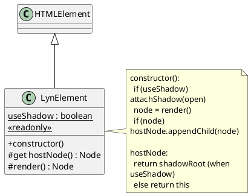

# LynElement — 최소 스펙

객체 지향 방식으로 프레임워크를 설계할 때는 모든 컴포넌트가 공통적으로 따라야 하는 **생명주기, 계약, 확장 포인트**를 한
곳에 모아둔 베이스 클래스가 필요하다. 이 베이스가 있어야 이후에 기능을 확장할 때 일관성을 유지하고, 프레임워크 차원에서
새로운 철학(예: 리액티비티, SSR, 렌더링 정책)을 자연스럽게 얹을 수 있다.

LynJS에서는 그 역할을 맡는 클래스가 바로 `LynElement`다. 모든 커스텀 엘리먼트는 이 클래스를 상속받아 만들어지며,
여기서부터 LynJS의 철학이 점진적으로 구현된다.

웹 표준에서 커스텀 엘리먼트를 만들기 위한 기본 클래스는 `HTMLElement`다. `LynElement`는 이를 확장하여, 개발자가 표준을
직접 다루는 수고를 줄이고 보다 쉽게 커스텀 엘리먼트를 지원할 수 있도록 한다.

`LynElement`는 LynJS에서 **모든 Custom Element의 공통 베이스**가 된다. 지금은 **아무 동작도 강제하지 않는 껍데기**이며,
오직 `render()`만 제공한다.

## 목표

- **HTMLElement를 상속한 비어 있는 베이스 클래스**를 `@lynjs/core`에 만들고, **`render()` 메서드까지만** 정의한다.
- 여기서부터 LynJS 철학(플랫폼 친화, 객체지향 리액티비티, HMR/SSR 등)을 **점진적으로 얹어갈 예정**이다.

## 설계

- `render()`는 Node를 반환해야 하며, constructor에서 hostNode에 한 번 추가된다.
- hostNode는 `static useShadow` 설정에 따라 shadowRoot 또는 자신(this)을 사용한다.
- `static readonly useShadow = true` 기본값으로 Shadow DOM을 지원한다.
- 필요하면 하위 클래스에서 `static override readonly useShadow = false as const;` 로 정책을 바꿀 수 있다.
- 이 구조는 이후 상태 관리, 데코레이터, SSR 확장 등을 위해 확장 포인트를 제공한다.

### render()

- 역할: 컴포넌트의 **초기 UI를 구성하는 단일 진입점**. 사이드 이펙트를 최소화하기 위해 **Node를 반환**하는 순수한 팩토리
  역할에 가깝게 둔다.
- 이유: 반환값을 통해 **부착 대상(hostNode)과의 결합을 낮추고**, 이후에 교체/패치(diff) 전략을 도입하더라도 인터페이스를
  유지할 수 있다.
- 동작: 생성자에서 `render()`를 1회 호출하고, 반환된 `Node`를 `hostNode.appendChild(...)`로 부착한다.

### hostNode

- 역할: 컴포넌트가 그릴 **일관된 부착 지점**. Shadow DOM 사용 여부에 따라 `shadowRoot` 또는 `this`를 투명하게 제공한다.
- 이유:
  - Shadow DOM 도입 전후로도 컴포넌트 코드가 변하지 않도록 **추상화 레이어**를 둔다.
  - `get hostNode()` 접근 시 **필요하면 lazy하게 `shadowRoot`를 생성**해 초기화 순서를 단순화한다.
- 네이밍: 표준 DOM의 `getRootNode()`와 혼동을 피하고, **shadow host** 문맥을 드러내기 위해 `hostNode`를 선택했다.

### useShadow (readonly)

- 역할: 클래스 단위로 **Shadow DOM 사용 정책**을 선언한다. 런타임 변경은 허용하지 않기 위해 `static readonly`로
  고정한다.
- 기본값: `true` — 스타일/DOM 격리를 기본으로 제공한다.
- 변경: 하위 클래스에서만 **정책 오버라이드**가 가능하다.
  ```ts
  export class PlainElement extends LynElement {
    static override readonly useShadow = false as const;
    protected render(): Node {
      return document.createTextNode('no shadow');
    }
  }
  ```
- 효과: 스타일 캡슐화(폴리곤/리셋 충돌 최소화), 슬롯/스코핑 관리가 용이하며, 필요 시 정책적 선택으로 비활성화할 수 있다.



## 코드 샘플

### `packages/core/src/lyn-element.ts`

```ts
// 최소 스펙: HTMLElement 상속 + render()만 제공
// - render(): Node를 리턴
// - constructor에서 render()를 호출해 hostNode에 1회 추가
// - hostNode는 static useShadow 여부에 따라 shadowRoot 또는 자신(this)
export class LynElement extends HTMLElement {
  /**
   * 컴포넌트 루트 선택: shadow를 쓸지 여부.
   * true면 open shadow root를 생성해 사용한다.
   */
  static readonly useShadow = true as const;

  /** 현재 컴포넌트가 그릴 루트. shadow 사용 시 shadowRoot, 아니면 this */
  protected get hostNode(): ParentNode & Node {
    const Class = this.constructor as typeof LynElement;
    if (Class.useShadow) {
      // 최초 접근 시 shadowRoot가 없다면 생성
      return (this.shadowRoot ?? this.attachShadow({ mode: 'open' })) as unknown as ParentNode & Node;
    }
    return this as unknown as ParentNode & Node;
  }

  constructor() {
    super();
    // useShadow가 true면 미리 생성해 둔다(초기 렌더 대상 보장)
    if ((this.constructor as typeof LynElement).useShadow && !this.shadowRoot) {
      this.attachShadow({ mode: 'open' });
    }
    // 초기 렌더 결과를 루트에 부착 (1회)
    const node = this.render();
    if (node) this.hostNode.appendChild(node);
  }

  /**
   * 서브클래스가 오버라이드해 Node를 반환한다.
   * 기본 구현은 빈 텍스트 노드를 반환(no-op에 가깝게 유지).
   */
  protected render(): Node {
    return document.createTextNode('');
  }
}
```

### `packages/core/src/index.ts`

```ts
export { LynElement } from './lyn-element';
```

## 단순하게 시작하는 이유

- **가까운 플랫폼**: 먼저 `HTMLElement` 상속으로 표준 생명주기를 그대로 가진다.
- **확장 포인트 확보**: 불필요한 마법 없이 `render()`만 열어두면, 이후 정책(스케줄/템플릿/리액티비티)을 **명시적으로
  주입**하기 쉽다.
- **점진적 설계**: 실제 철학(객체지향 리액티비티, HMR/SSR)은 다음 단계에서 안전하게 추가한다.
- **Shadow DOM 지원**: `static readonly useShadow = true`를 통해 각 컴포넌트가 자신의 스타일과 DOM 구조를 격리할 수
  있으며, 필요에 따라 이 기본 설정을 하위 클래스에서 오버라이드해 끌 수도 있다.
